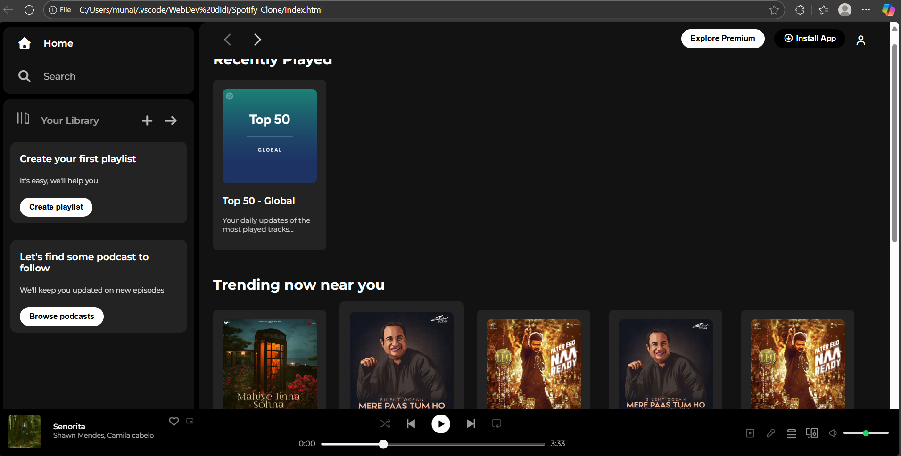

# 🎧 Spotify Clone - HTML & CSS Only

🚀 **Live Demo:** [View Site Here](https://passionate-coder26.github.io/Spotify_Clone_HTML_AND_CSS_ONLY/)

---

## 📑 Project Overview
This is a **Spotify Web Player Clone** built using only **HTML and CSS**.  
It replicates the **UI design of Spotify's desktop web player**, including sidebar navigation, trending playlists, sticky header, and a bottom music player — all with no JavaScript.

---

## 📂 Project Structure
```
/
├── index.html
├── style.css
└── assets/
    ├── logo.png
    ├── card1img.jpeg
    ├── ... (other icons/images)
```

---

## ✨ Features
- Responsive Sidebar Navigation (Home, Search, Library)
- Sticky Navbar with icons and install button
- Playlist Cards Layout (Recently Played, Trending, Featured Charts)
- Bottom Music Player with controls & volume bar
- Hover Effects & Badges using Pure CSS
- Mobile Responsive adjustments with Media Queries
- Deployed via **GitHub Pages**

---

## 🛠️ Tech Stack
- HTML5
- CSS3 (Flexbox, Positioning, Media Queries)
- Font Awesome (Icons)
- GitHub Pages (Deployment)

---

## 📸 Screenshot


---

## 🚀 Deployment
This project is deployed using **GitHub Pages**  
You can view the live version here:  
🔗 [https://passionate-coder26.github.io/Spotify_Clone_HTML_AND_CSS_ONLY/](https://passionate-coder26.github.io/Spotify_Clone_HTML_AND_CSS_ONLY/)

---

## 📈 Learning Outcomes
- Practiced advanced **Flexbox layouts** for responsive design.
- Understood **positioning concepts** (relative, absolute, sticky, fixed).
- Learned to structure frontend-only projects for deployment.
- Gained hands-on experience with **GitHub Pages**.

---

## 🙌 Feedback & Contributions
If you have any suggestions or feedback, feel free to open an issue or pull request.  
Pull Requests are welcome! ⭐

---

## 📩 Connect with Me
- [GitHub](https://github.com/passionate-coder26)
- [LinkedIn](https://www.linkedin.com/in/abhiramnair436)

---
